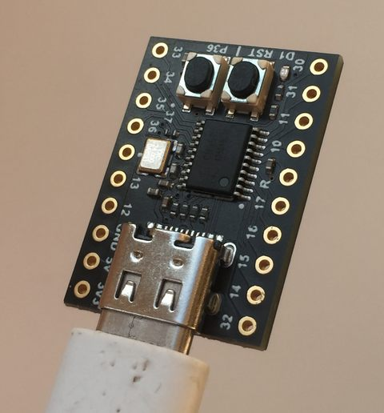
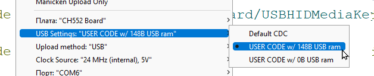

# WeAct-CH552-Volume-controller
USB volume and play/pause controller on WeAct CH552 microcontroler. 
----------
This sketch turns WeAct CH552 into media controller. With it you can control volume and Pause/Play media on connected device.

 
This is how my board looks.

Demonstration of work:
https://youtu.be/H8G2EMKqmB8

Setup.
-----

No soldering needed. All you need is stock controller board (from Ali, probably) and USB cable.

Program for Arduino development platform.
To setup Arduino addons, follow official instructions:
https://github.com/WeActStudio/WeActStudio.CH552CoreBoard/tree/master/SDK/02-ArduinoExample

To compile this program, check Tools -> USB Settings -> USER CODE w/ 148B USB ram

 
Select this setiing in Arduino to upload.

This mode is essential for USB keyboard emullation. Unfortunately, in this mode board does not emulate usual CDC device. That means two things:
* **No usual serial device**. You can not comunicate to board via Serial.
* **No automatic boot mode**. Your board will not automatically switch to boot mode once Arduino tries to upload new scetch. So, in order to re-upload, you'll have to enter boot mode again. To enter boot mode, press P36 button and replug the device.

After uploading this script it will emulate USB media keyboard.   Actually, it only emulates three keys: VolumeUP, VolumeDown, PlayPause. On how to use working device, see video.

